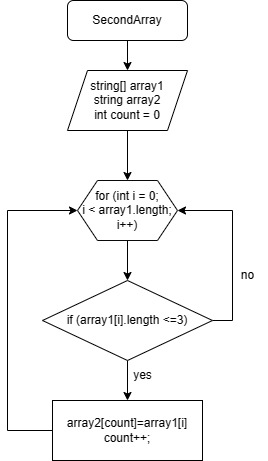

## Задача : 
Написать программу, которая из имеющегося массива строк формирует массив из строк, длина которых меньше либо равна 3 символа. Первоначальный массив можно ввести с клавиатуры, либо задать на старте выполнения алгоритма. При решение не рекомендуется пользоваться коллекциями, лучше обойтись исключительно массивами.
## Описание решения:
Объявляется два массива: первый и вторый такой же длины. Далее метод, в котором цикл равен длине массива, в цикле проверка условия ( <=3 ), если да, то элемент первого массива заносится в count элемент второго массива. Переменная count чтобы поочередно закидывать из первого массива во второй и чтобы потом не было пробелов. После добавления переменная count увеличивается на 1 и возвращается к циклу for в котором i увеличивается на 1. И так проверяется весь массив.

